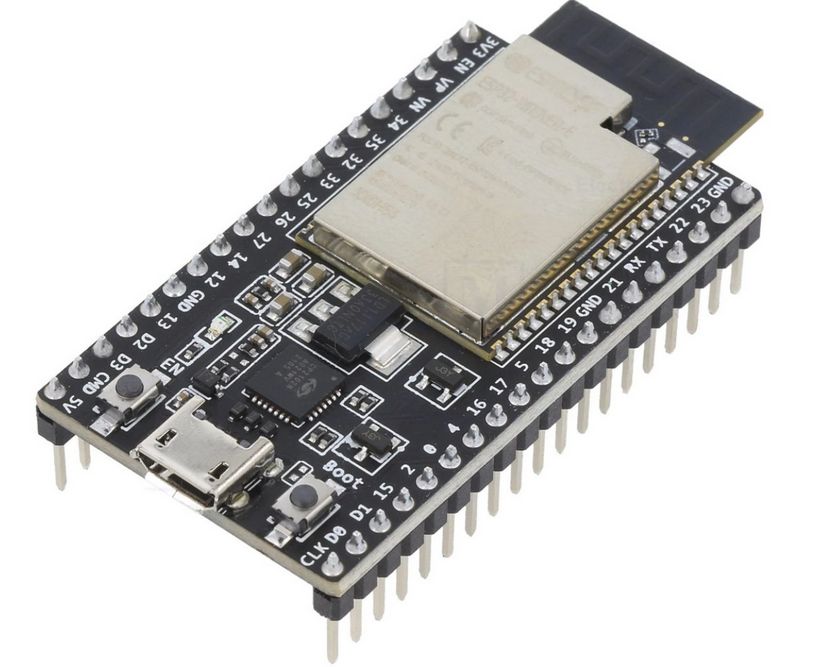
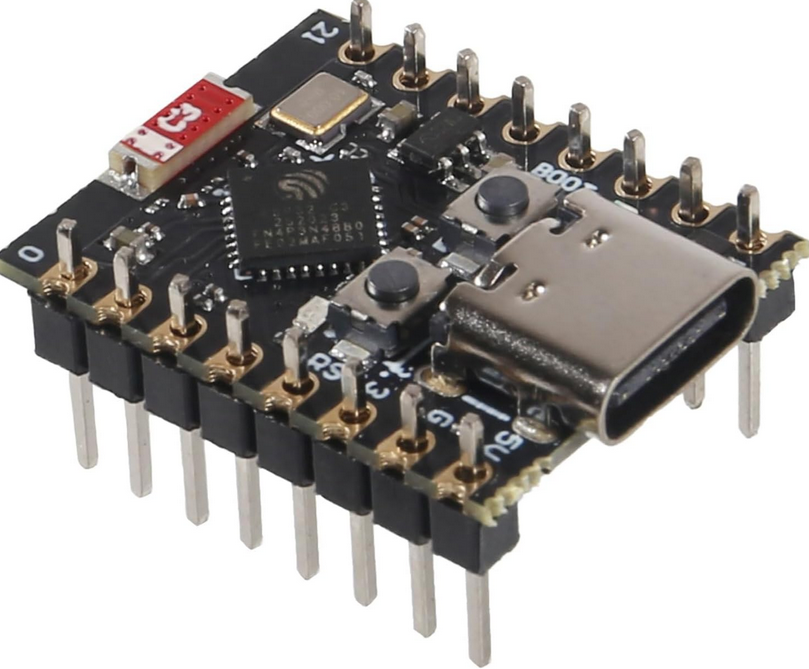

## Supported ESP-32 Boards

It is hard to provide link of what to buy since everyone is located at different places so instead I have opted to give some guidelines when buying ESP32 devices.

- Stick to the ESPHome recommendations `ESP32`, `ESP32S3` and `ESP32C3` devices
- Pay at least 6-8 €/£/$ for your esp device
- Avoid SuperMini devices as they often have the antenna too close to the rest of the electronics
- Perferably it should have a shield
- Avoid ceramic antennas

Sheilded with pcb antenna (black part sticking out) | Unsheilded with ceramic antenna (red rectangle)
:-------------------------:|:-------------------------:
 |  

This is not in any terms any perfect guidelines, but mainly what we have learned from all the users in the discord and here on github!

## More technical/examples

Antenna too close: https://www.reddit.com/r/esp32/comments/1dsh3b5/warning_some_c3_super_mini_boards_have_a_design/

There seems to be two major issues with bad ESP designs and the neato robots
1. Smaller/Cheaper ESP boards lack proper brownout protection
    - A brownout means that the voltage drops and if the ESP does not have proper protection against this, the device will restart
2. Antenna is placed too close to the rest of the electronics, causing interferance or refusal to work

